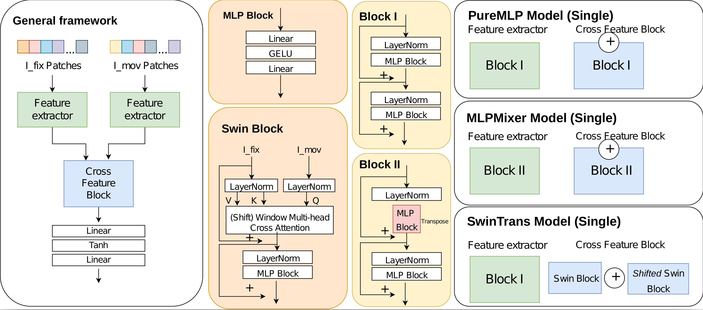

# Image Registration via Patch-based MLP and Transformer

## Introduction 
This repository contains scripts and functions used for STACOM2022 paper 'Unsupervised Echocardiography Registration through Patch-based MLPs and Transformers'. 

## Usage
- Model related files: mlp\_model (proposed three patch-based MLP/Transformer models), vxm\_model (the 2D VoxelMorph model), modelio (basic model class), swin\_trains\_utils (useful functions for SwinTrans model), layers (useful layer class)
- helper files: losses (loss function), utils (help functions), metrics (evaluation functions)
- dataset related files: generators (specific CAMUS data generator) 
- train\_model: script used to train different models, need to declare the different settings in config\_model.ini file 

Please kindly cite the following paper if you used this code:

Zihao Wang, Yingyu Yang, Maxime Sermesant, Hervé Delingette. Unsupervised Echocardiography Registration through Patch-based MLPs and Transformers. STACOM 2022 - 13th workshop on Statistical Atlases and Computational Models of the Heart, Sep 2022, Singapore, Singapore. ⟨hal-03792276⟩

### Bibtex:
@inproceedings{wang:hal-03792276,
  TITLE = {{Unsupervised Echocardiography Registration through Patch-based MLPs and Transformers}},
  AUTHOR = {Wang, Zihao and Yang, Yingyu and Sermesant, Maxime and Delingette, Herv{\'e}},
  URL = {https://hal.inria.fr/hal-03792276},
  BOOKTITLE = {{STACOM 2022 - 13th workshop on Statistical Atlases and Computational Models of the Heart}},
  ADDRESS = {Singapore, Singapore},
  YEAR = {2022},
  MONTH = Sep,
  KEYWORDS = {Unsupervised Registration ; MLP ; Transformer ; Echocardiography},
  PDF = {https://hal.inria.fr/hal-03792276/file/REG_STACOM2022.pdf},
  HAL_ID = {hal-03792276},
  HAL_VERSION = {v1},
}
